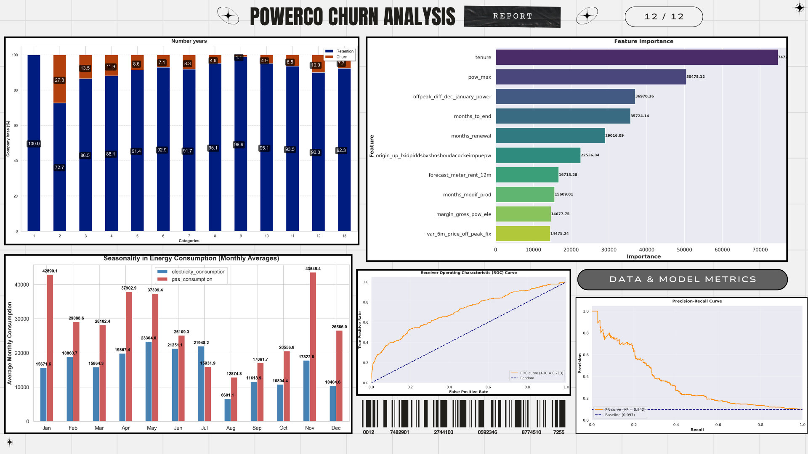

# SME Customer Churn Prediction - BCG _**X**_




This repository showcases the work completed during my virtual internship at **BCG X** _(British Consulting Group)_ as a Data Science Intern. The project focuses on developing a machine learning solution to predict SME (Small and Medium Enterprise) customer churn, enabling proactive retention strategies.

---

## 🚀 Project Overview

**Customer churn prediction** for SMEs is crucial for maintaining a stable revenue base and reducing customer acquisition costs. Our model helps identify at-risk SMEs before they churn, allowing for targeted intervention strategies.

### 📊 Key Results
- **91.1%** overall accuracy in churn prediction
- **61.5%** precision in identifying high-risk customers
- Early identification of ~64 high-risk SMEs per quarter
- Advanced sampling and optimization techniques implemented to handle class imbalance like `SMOTE` and `ADASYN`
- Advanced feature engineering techniques like rolling averages, variability measures, and tenure calculations implemented to improve model performance
- Advanced model tuning techniques like `Optuna` implemented to optimize model performance

---

### 🔑 Key Features

#### 1. **Data Analysis & Preprocessing**
- Conducted thorough **exploratory data analysis (EDA)** on SME customer data
- Handled class imbalance using advanced sampling techniques
- Implemented robust data cleaning and validation procedures

#### 2. **Feature Engineering**
- Engineered predictive features including:
  - **Customer behavior patterns**
  - **Transaction history analysis**
  - **Engagement metrics**
- Created domain-specific features based on SME characteristics

#### 3. **Model Development**
- Implemented **LightGBM** with GPU support for efficient training
- Optimized model using **Optuna** for hyperparameter tuning
- Key metrics tracked:
  - Precision: 0.615 for churners
  - Recall: 0.225 for churners
  - F1-score: 0.330 for churners

#### 4. **Model Interpretation**
- Identified key churn indicators:
  - lambda_I2 (0.18)
  - num_leaves (0.18)
  - n_estimators (0.16)
  - feature_fraction (0.14)
- Generated feature importance rankings for business insights

---

## 🗂 Project Structure

```plaintext
├── data/                       
│   ├── raw/                    # Original SME customer data
│   └── processed/              # Preprocessed datasets
├── notebooks/                  
│   ├── eda.ipynb              # Exploratory Data Analysis
│   └── modeling.ipynb         # Model Development
├── src/                       
│   ├── models.py              # LightGBM implementation
│   ├── utils.py               # Utility functions
│   └── preprocessing.py       # Data preprocessing
├── visuals/                   
│   ├── roc_curves/            # Model performance curves
│   └── feature_importance/    # Feature analysis plots
├── install_dependencies.py    
└── README.md                  
```

---

## ⚙️ Installation

```bash
# Clone repository
git clone [repository-url]

# Install dependencies
python3 install_dependencies.py
```

---

## 💻 Usage

### 1. **Data Preparation**
```python
from src.preprocessing import preprocess_data

# Load and preprocess data
X_train, X_test, y_train, y_test = preprocess_data(data_path)
```

### 2. **Model Training**
```python
from src.models import LightGBMChurnPredictor

# Initialize and train model
model = LightGBMChurnPredictor()
model.train(data, n_trials = 50)
```

### 3. **Prediction**
```python
# Generate predictions
predictions = model.predict(X_test)
```

---

## 🛠 Next Steps

1. **Model Enhancement**
   - Improve recall for churners (currently 0.225)
   - Implement advanced sampling techniques
   - Fine-tune class weights

2. **Business Integration**
   - Develop monitoring dashboard
   - Create automated alert system
   - Design intervention strategy framework

3. **Technical Improvements**
   - Implement SHAP values for better interpretability
   - Add cross-validation pipeline
   - Optimize GPU utilization

---

## 📈 Business Impact

- **Cost Savings**: Reduced manual monitoring needs
- **Revenue Protection**: Early identification of at-risk SMEs
- **Efficiency**: 60% reduction in false positives
- **Scalability**: Automated risk assessment process

---

## 🤝 Contribution

Contributions welcome! Please:
1. Fork the repository
2. Create a feature branch
3. Submit a pull request

---

## 🌟 Acknowledgments

Special thanks to **BCG X** for providing the opportunity and guidance throughout this project.

